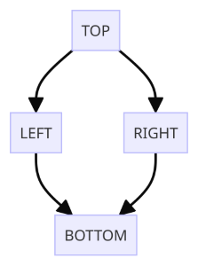

# Exploring HTCondor's DAGMan

This tutorial helps you explore HTCondor's DAGMan its many features.
At the top level is a worked example of a "Diamond DAG" that summarizes the basic components of a creating, submitting, and managing DAGMan workflows.
In the lower level [/additional_examples](/additional_examples/) directory are more worked examples with their own `README`s highlighting specific features that can be used with DAGMan.
Brief descriptions of these examples are provided in the [Additional Examples](#additional-examples) section at the end of this tutorial.

Before working on this tutorial, we recommend that you read through our other DAGMan guides:

* [Submit Workflows with HTCondor's DAGMan]() 
* [Simple Example of a DAGMan Workflow]()

The definitive guide to DAGMan is [HTCondor's DAGMan Documentation](https://htcondor.readthedocs.io/en/latest/automated-workflows/index.html).

## Types of DAGs

While any workflow that satisfies the definition of a ["Directed Acyclic Graph" (DAG)](https://en.wikipedia.org/wiki/Directed_acyclic_graph) can be executed using DAGMan, there are certain types that are the most commonly used:

* **Sequential DAG**: all the nodes are connected in a sequence of one after the other, with no branching or splitting. This is good for conducting increasingly refined analyses of a dataset or initial result, or chaining together a long-running calculation. The simplest example of this type is used in the guide [Simple Example of a DAGMan Workflow](). 
* **Split and recombine DAG**: the first node is connected to many nodes of the same layer (split) which then all connect back to the final node (recombine). Here, you can set up the shared environment in the first node and use it to parallelize the work into many individual jobs, then finally combine/analyze the results in the final node. The simplest example of this type is the "Diamond DAG" - the subject of this tutorial.
* **Collection DAG**: no node is connected to any other node. This is good for the situation where you need to run a bunch of otherwise unrelated jobs, perhaps ones that are competing for a limited resource. The simplest example of this type is a DAG consisting of a single node.

These types are by no means "official", nor are they the only types of structure that a DAG can take. Rather, they serve as starting points from which you can build your own DAG workflow, which will likely consist of some combination of the above elements.

## The Diamond DAG

As mentioned above, the "Diamond DAG" is the simplest example of a "split and recombine" DAG.
In this case, the first node `TOP` is connected to two nodes `LEFT` and `RIGHT` (the "split"), which are then connected to the final node `BOTTOM` (the "recombine").



To describe the flow of the DAG and the parts needed to execute it, DAGMan uses a custom description language in an input file, typically named `<DAG Name>.dag`. 
The two most important commands in the DAG description language are:

1. `JOB <NodeName> <NodeSubmitFile>` - Describes a node and the submit file it will use to run the node.
2. `PARENT <NodeName1> CHILD <NodeName2>` - Describes the edge starting from `<NodeName1>` and pointing to `<NodeName2>`.

These commands have been used to construct the Diamond DAG and are saved in the file `diamond.dag`. 
To view the contents of `diamond.dag`, run 

```
cat diamond.dag
```

Before you continue, we recommend that you closely examine the contents of `diamond.dag` and identify its components. 
Furthermore, try to identify the submit file for each node, and use that submit file to determine the nature of the HTCondor job that will be submitted for each node.

## Submitting a DAG

To submit a DAGMan workflow to HTCondor, you can use one of the following commands:

```
$ condor_submit_dag diamond.dag
  or
$ htcondor dag submit diamond.dag
```

## What Happens?

When a DAG is submitted to HTCondor a special job is created to run DAGMan
on behalf of you the user. This job runs the provided HTCSS DAGMan executable
in the AP job queue. This is an actual job that can be queried and acted upon.

You may also notice that lots of files are created. These files are all part
of DAGMan and have various purposes. In general, the files that should
always exist are as follows:

* DAGMan job proper files
  1. `<DAG Name>.condor.sub` - Submit file for the DAGMan job proper
  2. `<DAG Name>.dagman.log` - Job event log file for the DAGMan job proper
  3. `<DAG Name>.lib.err` - Standard error stream file for the DAGMan job proper
  4. `<DAG Name>.lib.out` - Standard output stream file for the DAGMan job proper
* Informational DAGMan files
  1. `<DAG Name>.dagman.out` - General DAGMan process logging file
  2. `<DAG Name>.nodes.log` - Collective job event log file for all managed jobs (Heart of DAGMan)
  3. `<DAG Name>.metrics` - JSON formatted information about the DAG

Of these files, the two most important are the `<DAG Name>.dagman.out` and `<DAG Name>.nodes.log`. 
The `.dagman.out` file contains the entire history and status of DAGMan's execution of your workflow. 
The `.nodes.log` file on the other hand is the accumulated log entries for every HTCondor job that DAGMan submitted, 
and DAGMan monitors the contents of this file to generate the contents of the  `.dagman.out` file. 

> Note: these are not all the files that DAGMan can produce.
> Depending on the options and features you employ in your DAG input file, more files with different purposes can be created. 

## Monitoring DAGMan

Since DAGMan is submitted to the AP job queue as a job itself and all jobs
managed by DAGMan are submitted to the AP job queue, the normal methods of
job monitoring work. For more inforomation checkout
[DAGMan Interaction Documentation](https://htcondor.readthedocs.io/en/latest/automated-workflows/dagman-interaction.html)

The primary way of running a query on the job queue will result in an
condensed batch view of jobs submitted, running, and managed by the
DAGMan job proper. You can add one or two more flags to get more per
job information about jobs running under DAGMan:

```
# Basic job query (Batched/Condensed)
$ condor_q

# Non-Batched query
$ condor_q -nobatch

# Increased information
$ condor_q -nobatch -dag
```

You can also watch the progress of the DAG and the jobs running under it
by running:

```
$ condor_watch_q
```

Finally, if the DAGMan job is still running or in the AP job queue then you
can get lots of information about the DAG such as nodes states, submitted jobs,
and overall progress by running:

```
$ htcondor dag status <DAGManJobId>
```

Note: The DAGMan job ID is the cluster ID of the DAGMan job proper.

## Where do my jobs run?

It can be difficult to discern where your job is ran from, and the short
answer is DAGMan does work from the working directory that you submitted
it from. Meaning all other work such as job submission will be relative to
the directory DAGMan was submitted from.

This can be oberved by inspecting the sleep.sub submit file in the SleepJob
sub-directory and the diamond.dag decription file. In the diamond.dag file
the jobs are declared with

```
./SleepJob/sleep.sub
```

meaning the submit file is sleep.sub found at SleepJob directory in this
current directory. Similarly, inside sleep.sub the log command is set to
a similar path so that the job event log is written to the sub-directory
SleepJob. This only applies to information using relative paths.

This is just the default behavior, and there are ways to make the location
of job submission/management more obvious.

[File Paths in DAGs Documentation](https://htcondor.readthedocs.io/en/latest/automated-workflows/dagman-file-paths.html)

## Additional Examples

Additional examples are provided in the folder `additional_examples` with corresponding READMEs. 
The following order of tutorial examples to cover various topics related to DAGMan is recommended:

1. RescueDag - Example for DAGs that don't exit successfully
3. PreScript - Example using a pre-script for a node
4. PostScript - Eample using a post-script for a node
5. Retry - Example for retrying a failed node
6. VARS - Example of reusing a single submit file for multiple nodes with differing variables
7. SubDAG (advanced) - Example using a subdag
8. Splice (advanced) - Example of using DAG splices
