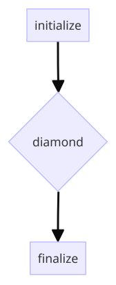
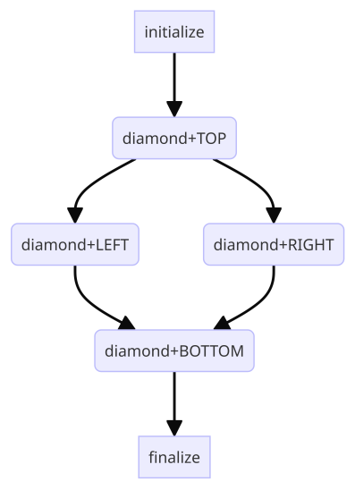

# DAG Splicing

Similar to a SubDAG, DAG splicing is a way of creating a complex DAG from smaller individual DAGs.
When a smaller DAG is spliced into the larger DAG, every node within the smaller DAG is incorporated
into the larger DAG, resulting in one single DAG.

When the spliced DAG workflow is executed, there is only ever one DAGMan job proper.
For this reason, a spliced DAG workflow will not use as many resources on the AP (access point) as a
SubDAG, since every SubDAG in a workflow creates its own DAGMan job when called.
This is the main advantage of using DAG splicing over using SubDAGs. 
Another advantage is that DAG-wide options will apply to the spliced nodes.

A disadvantage of using DAG splicing instead of SubDAGs is that node-specific options (e.g., `SCRIPT`, `RETRY`, `VARS`)
cannot be applied to the DAG splice as a whole, and instead must be defined within the `.dag`
input file that is being spliced into the larger DAG.
Another disadvantage is that all the DAG information for the spliced nodes must be declared 
at submission time for the larger DAG.

The syntax for DAG splicing is as follows:

```
SPLICE <Splice Name> <Splice Input>.dag
```

where `<Splice Name>` is similar in use to a `JOB` node name, and `<Splice Input>.dag` 
defines the DAG that is to be spliced. 
The spliced DAG can then be referenced when defining PARENT/CHILD relationships by using the `<Splice Name>`. 

> The PARENT/CHILD relationships for a splice are applied to the first and last nodes 
> within the spliced DAG. 
> That is, if splice `X` is the CHILD of node `A`, then every first (top-level) node defined 
> in the `X` DAG input file will be a CHILD of node `A`.
> Similarly, if splice `X` is the PARENT of node `B`, then every last (bottom-level) node 
> defined in the `X` DAG input file will be a PARENT of `B`.
> This can lead to an exponential number of dependencies when a splice with many 
> nodes is the PARENT of another splice with many nodes.

Since the nodes defined in the spliced DAG are copied into the larger DAG, they are 
also renamed to help keep track of their origin.
The nodes are renamed using the syntax `<Splice Name>+<Original Node Name>` where
`<Original Node Name>` is the name of the node as defined in `<Splice Input>.dag`. 
This allows you to define multiple splices using the same input DAG.
For example, if `<Splice Input>.dag` defines node `A` and you define a splice `X`
and splice `Y` using that input DAG, the resulting node names in the larger DAG would 
be `X+A` and `Y+A`, respectively.

To illustrate what DAG splicing is, consider the following scenario: you've constructed
a diamond DAG workflow (`diamond.dag`) and would like to add nodes before and
after the diamond (`initialize` and `finalize)`. 
You could directly edit `diamond.dag` to add the nodes, but you could also create a new
DAG with the diamond DAG spliced in.
The input file for the spliced DAG would look like this:

```
# spliced.dag
JOB initialize initialize.sub
JOB finalize finalize.sub
SPLICE diamond diamond.dag

PARENT initialize CHILD diamond
PARENT diamond CHILD finalize
```

With this input file, we've defined the following relations:



When submitted, DAGMan will copy the nodes from `diamond.dag` into the spliced DAG (with renaming), so that the actual nodes and relationships look like this:



## Exercise

For the exercise, we will consider a slightly more complicated example. 
First, examine the contents of `spliced.dag` and identify the relationships of the nodes/splices therein.
Next, examine the contents of `cross.dag` and identify the relationships of its nodes.
Finally, try to construct what the full DAG workflow will look like after the `cross.dag` nodes have been
spliced into `spliced.dag`.

Check your understanding using the following figures:

[spliced.dag](../../.images/SplicedCrossDAG.png)

[cross.dag](../../.images/CrossDAG.png)

[Full DAG after splicing](../../.images/SplicedCrossDAGFull.png)

Now submit the spliced DAG without modification:

```
$ condor_submit_dag spliced.dag
```

Monitor the progress of the DAG. 
A total of 12 jobs should be submitted by DAGMan, and the only DAGMan output files generated
are those corresponding to `spliced.dag`. 

For more information on the `SPLICE` utility, see the
[DAGMan Splicing Documentation](https://htcondor.readthedocs.io/en/latest/automated-workflows/dagman-using-other-dags.html#dag-splicing).

